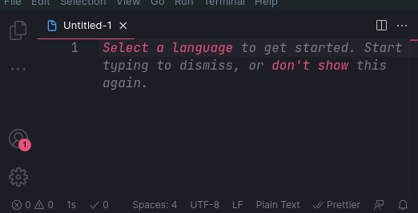

# ⏳ Coding timer [`extension`](https://marketplace.visualstudio.com/items?itemName=szymmis.coding-timer) for [_`VSCode`_](https://github.com/microsoft/vscode)

## 💬 Introduction

Have you ever wondered how much time do you spend **_actually_** coding?\
This extension counts time spending on doing your actual job instead of checking out reddit or instagram.

## ⚙️ How does it works?

1. Install the extension in `vscode`
2. Set up a delay in configuration or leave it as default `(5s)`
   - This setting is responsible for the amount of time it takes to freeze your counter after last code change
3. Every time you modify any document in `vscode` delay is reset and the counter keeps increasing
4. When idle for enough time (haven't done any modification) the counter stops counting.

**_The goal of this tool is to show you how much time do you spend actually coding_** \
 The timer won't be resumed simply by using `vscode`\
You can resume it by

- Modifying any file
- Changing any character
- Copying and pasting
- Saving the file
- etc.

## 📝 Documentation

🚧 **Work in Progress** 🚧

## 🏦 License

[MIT](./LICENSE)

## 🖥️ Credits

[@szymmis](https://github.com/szymmis)
